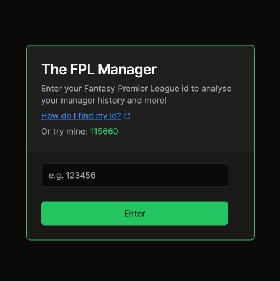

# Fantasy Premier League Manager Comparator

TFPLM is an evolution of the my The FPL Manager web application. It enhances the experience by providing deeper insights into a manager's performance, enabling comparisons with friends or rivals, and integrating a more dynamic and interactive user interface.

## Overview

This project is built upon the foundation of the original FPL Manager, retaining the core functionality while introducing new features and improvements. It consists of a Next.js frontend for a more robust and scalable application structure.

## Frontend Enhancements

The frontend has been migrated to Next.js from React, offering benefits such as server-side rendering and static site generation. The application architecture has been redesigned to leverage Next.js's app router capabilities, enhancing SEO and performance.

### Key Technologies:

- **Framework**: Next.js for improved performance and SEO.
- **State Management**: Redux Toolkit with redux-persist, maintaining efficient global state management.
- **HTTP Requests**: Axios for API calls.
- **UI Components**: Integration of Tailwind CSS for styling, Radix UI for accessibility-first components, and lucide-react for icons.
- **Data Visualization**: Recharts for rendering responsive and customizable charts and graphs.
- **Form Handling**: React Hook Form for form management.
- **Testing**: Transition to Jest for unit testing, alongside Cypress for end-to-end testing.
- **Linting and Formatting**: ESLint and Prettier continue to ensure code quality and consistency.
