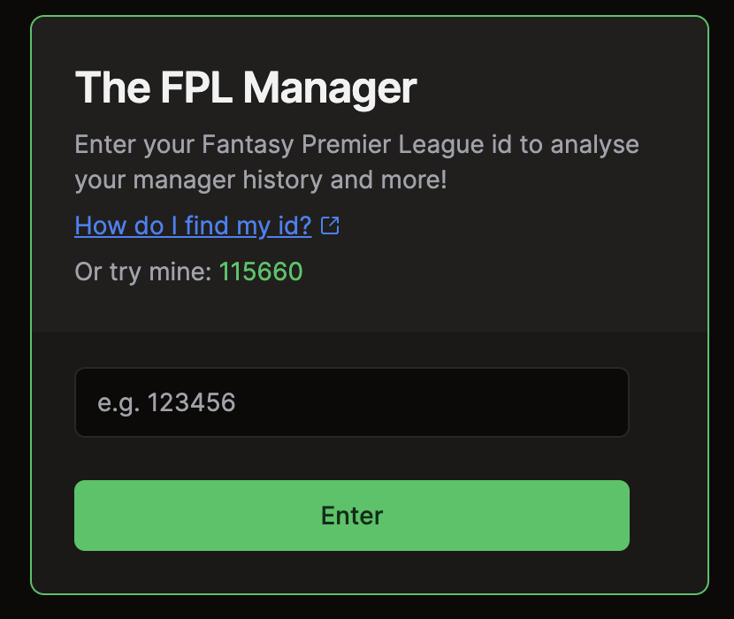

<!-- PROJECT LOGO -->

   
  

  <h3 align="center">TFPLM</h3>

  

## About The Project

TFPLM (The FPL Manager new and improved) is a web application that gives Fantasy Premier League managers the opportunity to view their historical performance as an FPL manager, and compare against their FPL manager friends (or enemies!).

### Built With

- ![Next.js][Next.js-logo]
- ![React][React.js-logo]
- ![Redux][Redux-logo]
- ![SWR][SWR-logo]
- ![Axios][Axios-logo]
- ![Framer Motion][FramerMotion-logo]
- ![Tailwind CSS][TailwindCSS-logo]
- ![Cypress][Cypress-logo]
- ![React Testing Library][ReactTestingLibrary-logo]
- ![ESLint][ESLint-logo]
- ![Prettier][Prettier-logo]

<!-- Reference Links -->

[Next.js-logo]: https://img.shields.io/badge/next.js-000000?style=for-the-badge&logo=nextdotjs&logoColor=white
[React.js-logo]: https://img.shields.io/badge/React-20232A?style=for-the-badge&logo=react&logoColor=61DAFB
[Redux-logo]: https://img.shields.io/badge/Redux-764ABC?style=for-the-badge&logo=redux&logoColor=white
[SWR-logo]: https://img.shields.io/badge/SWR-000000?style=for-the-badge&logo=swr&logoColor=white
[Axios-logo]: https://img.shields.io/badge/Axios-671DDF?style=for-the-badge&logo=axios&logoColor=white
[FramerMotion-logo]: https://img.shields.io/badge/Framer_Motion-0055FF?style=for-the-badge&logo=framer&logoColor=white
[TailwindCSS-logo]: https://img.shields.io/badge/Tailwind_CSS-38B2AC?style=for-the-badge&logo=tailwind-css&logoColor=white
[Cypress-logo]: https://img.shields.io/badge/Cypress-17202C?style=for-the-badge&logo=cypress&logoColor=white
[ReactTestingLibrary-logo]: https://img.shields.io/badge/RTL-20232A?style=for-the-badge&logo=testinglibrary&logoColor=red
[ESLint-logo]: https://img.shields.io/badge/ESLint-4B32C3?style=for-the-badge&logo=eslint&logoColor=white
[Prettier-logo]: https://img.shields.io/badge/Prettier-F7B93E?style=for-the-badge&logo=prettier&logoColor=black
